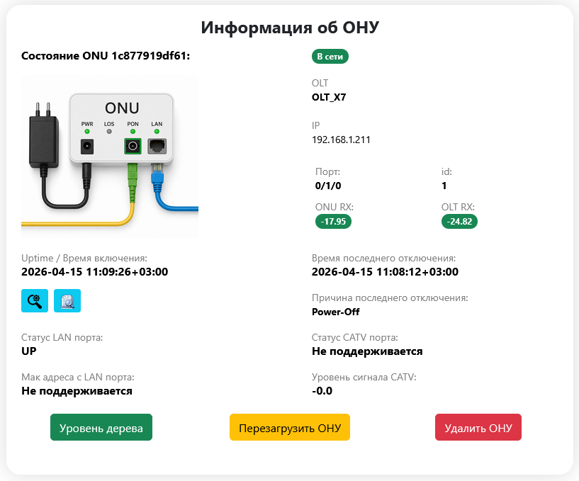
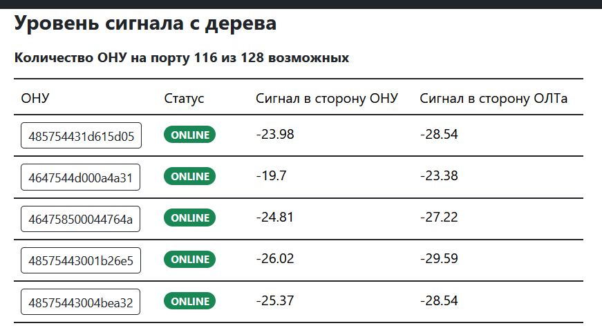

  
  
<strong>OLTs HUB</strong>

##  v3.2
WEB приложение для просмотра состояния абонентских оптических терминалов, фирмы Huawei и BDCOM\
Приложение работает с ОЛТами:\
Huawei MA5600, MA5800 (EPON, GPON).\
BDCOM 33xx, 36xx (EPON, GPON).\
~~C-DATA (EPON, GPON)~~.
С версии 3.0 ОЛТы C-DATA не поддерживаются, т.к. у меня нет на сети ОЛТов этой фирмы, и нет возможности для тестов. 

Полный список моделей и версий можно посмотреть в [файле](docs/platforms.md).

Абонентские терминалы поддерживаются только однопортовые, для Huawei поддерживается CATV порт.\
Если портов больше 1, то приложение работать будет, но статус LAN порта будет выводиться некоректно.\
Весь остальной функционал будет работать как надо.

 

#### [Инструкция по установке](docs/install.md)