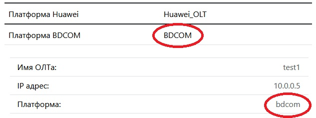

## Вход в приложение
Дефолтный логин/пароль - __root/admin__.

После входа в приложение, перейдите в меню настройки. Там необходимо заполнить все данные для работы.\
Если у вас уже была база, и Вы перешли со старой версии не удаляя её. То в меню 'Настройка NetBox' необходимо прописать платформы Ваших ОЛТов. Даже если вы не используете NetBox. Платформы нужны для определения производителя, т.к. у разных производителей разные SNMP OIDы.

<p align="center">

</p>

Если платформа в настройках и платформа у добавленого ОЛТа не будут совпадать, то данные с этого ОЛТа собираться не будут.

## Добавление ОЛТов
В меню "Настройки" нажмите раздел ОЛТы, там будет список, где можно добавлять/удалять и редактировать ОЛТы, сверху справа будет кнопка "Добавить ОЛТ". Откроется страница на которой можно добавить ОЛТ вручную, запонив все поля, или в самом низу получить список из NetBox.
Если настройки NetBox корректные, то через пару секунд приложение поддянет список ОЛТов. 
И на экран будет выведено сообщение об успешном выполнении.

Затем нажать кнопку "Опросить ОЛТы".\
Это запустит процесс опроса __ВСЕХ__ ОЛТов в списке.\
В зависимости от количества ОЛТов и зарегистрированных ОНУ, 
этот процесс может занять от нескольких секунд до нескольких минут.\
Здесь нужно дождаться сообщения об успешном опросе.\
Как дальше работать с программой можно почитать в разделе "справка".

## Настройка с NetBox
В NetBox необходимо создать теги для Epon и Gpon и привязать их к нужным ОЛТам, которые необходимо "опрашивать".\
Так же в NetBox необходимо создать платформу и привзать к ОЛТам.\
По умолчанию в конфигурации, платформы для НетБокса прописаны так:
```commandline
PF_HUAWEI = "Huawei_OLT"
PF_BDCOM = "BDCOM"
```
Это означает, что платформа должна содержать такие слова в названии.\
Например платформа, названная в НетБоксе как "BDCOM(tm) P3310B Software, Version 10.1.0B Build 63244", 
программой определится без проблем, т.к. содержит слово BDCOM.

## Группы
С верссии 3.0 появились группы. Пользователи находящиеся в определённой группе, будут видеть и опрашивать ОЛТы только своей группы. И не будут видеть чужие.
Администраторы, независимо от группы видят все ОЛТы.

## Подключение к ОЛТам
С верссии 3.0 появилась возможность задавать SNMP Community, а так же Telnet/SSH для каждого ОЛТа отдельно.
При опросе или подключении программа проверяет, есть ли в базе персональный логин/пароль, и если нету, то смотрит глобальный.
Для SNMP глобальный Community находятся в разделе Настройки -> SNMP. Для Telnet/SSH в файле __.env__
Для ОЛТов BDCOM доступен Telnet и SSH, для Huawei только SSH.